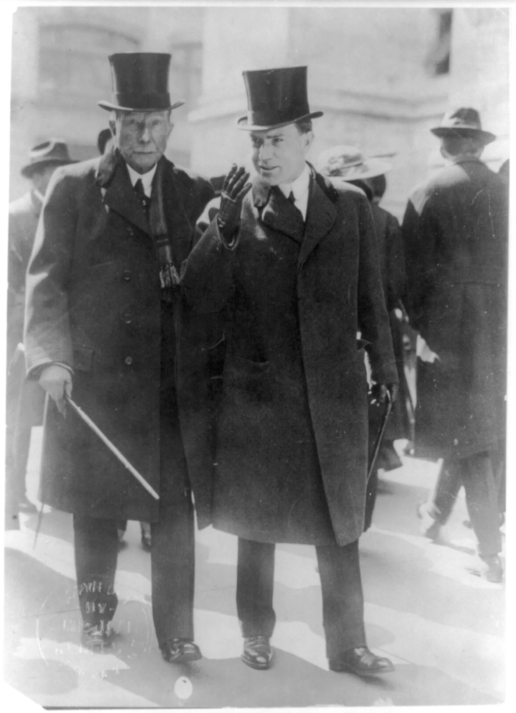
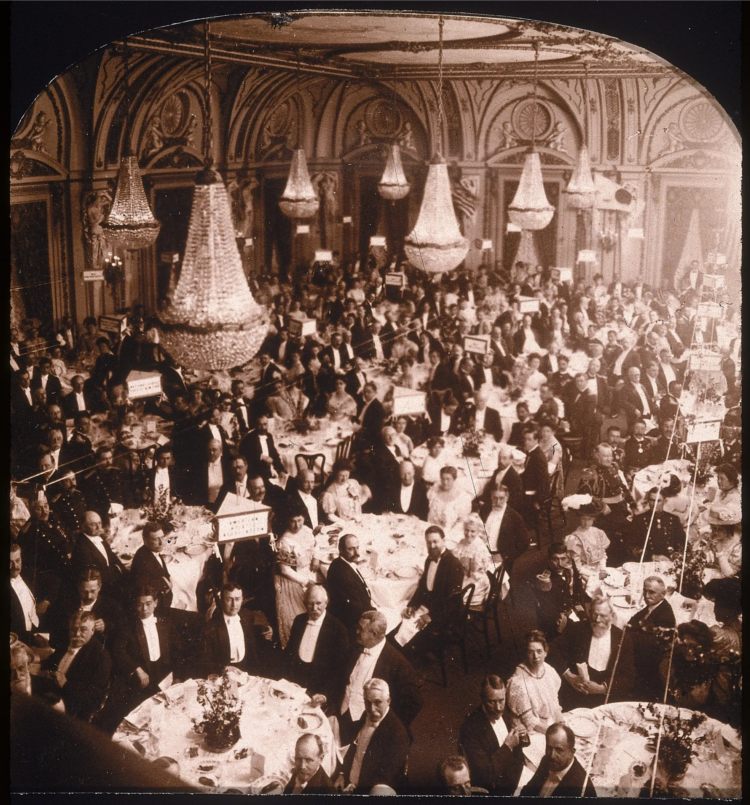

import InequalityChart from '../../components/InequalityChart.astro';

# Elon Musk and the First Trillionaire: What Rockefeller’s Fortune Shows

## What the First Billionaire Reveals About the First Trillionaire

As Elon Musk nears $1 trillion, the story of John D. Rockefeller shows how fortunes of that scale reshape markets, politics and public opinion.

By Ben Steverman

We seem to be entering our trillionaire era. As recently as late 2017, no one on Earth had ever been worth more than $100 billion. Less than a decade later, 18 people on the Bloomberg Billionaires Index clear that mark. A successful SpaceX initial public offering could make Elon Musk, whose fortune now tops $670 billion, the world’s first trillionaire. And at this rate, he may not be the last this decade.

If this feels unprecedented, it is. But it’s also reminiscent of another era. At the turn of the 20th century, bewildering social and technological changes, polarized politics and soaring wealth at the very top left Americans feeling anxious and confused. Among the concepts they struggled to grasp was the word “billion” itself. As the first billionaire fortune came into view, a newspaper noted in 1903 that a billion dollars is “as many dollars as there have been minutes since the dawn of Christianity.”

And yet our current challenge is wrapping our head around a thousand of those billions — as many dollars as there have been minutes since the dawn of the Ice Age.

The difference between four commas and three is vast. A billionaire can spend $1,000 every day for roughly 2,700 years, while a trillionaire could spend $1 million a day for just as long. Whether they’re Musk, Mark Zuckerberg or an as-yet-unknown contender from the artificial intelligence boom, what does that much wealth mean in the hands of one person?

John D. Rockefeller offers one answer. As early as 1890, when the 50-year-old’s net worth had barely cracked $100 million, people were predicting he would be the first billionaire. With Standard Oil throwing off cash, his wealth doubled by the end of the 19th century despite a nasty recession, then accelerated in the early 1900s. By 1915, his fortune was well past $1 billion, according to my analysis of available historical data.

*Illustration: Kimberly Elliot for Bloomberg*

Adjusted for inflation, Rockefeller’s $1.3 billion in 1915 is about $40 billion today, putting him at a mere 54th on the Bloomberg Billionaires Index. But a better way to gauge the power that his wealth wielded is to compare it with the size of the US economy. By this measure, Rockefeller in 1915 owned the largest private fortune ever assembled — an amount equal to roughly one-thirtieth of US GDP at the time, or just over $1 trillion in today’s dollars.

A person this rich isn’t like other wealthy people. Conspiracy theories aside, billionaires and multimillionaires rarely agree on anything, even tax policy. In politics, business and everything else, they’re often at odds. But as an individual’s wealth soars past a certain point, constraints and countervailing forces fall away. They win a unique ability to reshape the world, though as Rockefeller’s story also demonstrates, they are not all-powerful. Their pervasive influence can spark a backlash from the general public so ferocious that politicians feel they must respond.

<InequalityChart />

我们似乎正步入一个“万亿富翁”的时代。就在2017年末，地球上还没有人的身价超过1000亿美元。然而不到十年后的今天，彭博亿万富翁指数上已有18人跨越了这一大关。如果SpaceX（太空探索技术公司）成功上市，身价现已超6700亿美元的埃隆·马斯克有望成为世界首位万亿富翁。照此趋势，在本十年内，他或许不会是唯一的一位。

若这种感觉显得前所未有，那事实的确如此。但这同时也让人联想到另一个时代。在20世纪之交，剧烈的社会与科技变革、政治极化以及顶层财富的激增，曾令美国人深感焦虑与困惑。在当时人们难以理解的概念中，就包括“十亿”这个词本身。随着首位亿万富翁的财富初露端倪，一家报纸在1903年曾如此描述：十亿美元的数量，相当于“自基督教诞生以来经过的每一分钟”。

而我们当下面临的挑战，则是要去理解一千个那样的“十亿”——那相当于自冰河时代开启以来的每一分钟。

在数字的写法上，拥有四个逗号与拥有三个逗号的区别，其差距可谓天壤之别。亿万富翁可以每天花费1000美元，持续约2700年；而万亿富翁即便每天挥霍100万美元，也能维持同样长的时间。无论是马斯克、马克·扎克伯格，还是人工智能浪潮中尚未露面的挑战者，如此巨额的财富集中在一人手中，究竟意味着什么？

约翰·D·洛克菲勒给出了一个答案。早在1890年，当时这位50岁的实业家净资产刚突破1亿美元，人们就预言他将成为首位亿万富翁。凭借标准石油公司源源不断的现金流，尽管经历了严重的经济衰退，他的财富在19世纪末仍翻了一番，并在20世纪初加速增长。根据我对现有历史数据的分析，到1915年，他的财富已远超10亿美元。

## The Road to Riches

At the time of Rockefeller’s ascent, people couldn’t understand what anyone would do with $1 billion — a single dollar could buy the nicest dish at the fanciest restaurants in town. Even today, after 110 years of inflation, $1 billion is logistically difficult to spend in one lifetime. Jeff Bezos was criticized for his wedding in Venice, which reportedly cost around $20 million. But at that price, the couple could renew their vows in equally luxurious surroundings every weekend for the next year without hitting $1 billion.

To better understand what it feels like at the center of a vast fortune, I traveled by train along the icy Hudson River to Tarrytown, New York. My destination, the Rockefeller Archive Center, was a couple miles up into the hills from the station, behind a steel gate on what was once the family’s 3,000-acre estate. The Rockefeller archive’s home is Hillcrest, a tidy mansion built for John D. Rockefeller Jr.’s widow in 1963. Three levels of vaults under the house contain the records of the Rockefeller family, the philanthropies they founded and dozens of other organizations.

I chose to start with correspondence between Rockefeller Sr. and his only son. Overshadowed in history, John D. Rockefeller Jr. idolized his father and deferred to him for most of his first 40 years. More and more after 1910, however, it was the younger Rockefeller who ran the family affairs, while his retired septuagenarian father enjoyed a rigorous schedule of golf and automobile rides.

In the first folder I opened, the family’s idiosyncrasies leapt off the page. Rockefeller Sr. built Standard Oil by squeezing every cent from refining and shipping petroleum — an obsession with efficiency his son inherited. In one letter, Junior itemizes his annual expenses ($83,238.35, including a $25,000 donation to Brown University, his alma mater). In another, he declines as unnecessary an offer to upgrade the stables behind his New York City home. In yet another, he thanks his father for “a very substantial saving in our household expense” from the shipment of “$11.10 worth of asparagus.”

The letter reveals the Rockefellers’ trademark frugality alongside their extraordinary privilege. At a time when the average factory worker’s wage was 20 cents an hour, $11.10 of asparagus would have been an unimaginable luxury for almost everyone.

*John D. Rockefeller Sr. with his son. Photographer: Alpha Stock/Alamy/www.alamy.com*

The bigger difference between then and now may be how Americans reacted to that gulf. The Rockefellers and other industrialists faced fierce backlash — and politicians in both parties acted on it. In 1903, a Democratic congressman from Indiana proposed “to condemn as a public nuisance and a public peril” anyone worth more than $10 million, with the government confiscating the rest. President Theodore Roosevelt launched a legal assault on the “trusts,” including Standard Oil, and urged an estate tax on “those swollen fortunes which it is certainly of no benefit to this country to perpetuate.”

In this heated climate, private letters show neither Rockefeller wanted to be known as a billionaire. In 1916, Senior called press reports that he was worth $1 billion “preposterous.” Junior worried the articles were “having so unfortunate an influence on the public mind,” by supporting the arguments of progressives, communists and anarchists that US laws were “unwise or inadequate.”

The family’s advisers, including their public-relations guru, Ivy Lee, decided against issuing a statement. But two years later, after Forbes magazine placed the Rockefeller net worth at $1.2 billion, letters suggest Lee had a talk with the publisher. In the following issue, B.C. Forbes walked back his estimate, saying he’d since been assured Rockefeller was “nowhere near a billion dollars” after all.

## 致富之路

在洛克菲勒崛起的时代，人们无法理解有人会如何使用10亿美元——那时一美元就能在城里最高档的餐厅点上一道最精美的菜肴。即便在今天，在经历了110年的通货膨胀之后，10亿美元也是很难在一生中花完的数字。杰夫·贝索斯因在威尼斯举办婚礼而备受批评，据称这场婚礼耗资约2000万美元。但在这个价位上，即使这对夫妇未来一年每周都同样奢华的环境下重申誓言，也花不到10亿美元。

为了更好地理解身处巨额财富核心的感觉，我乘火车沿着冰封的哈德逊河前往纽约州塔里敦。我的目的地是洛克菲勒档案中心，从车站向山上走几英里，穿过一扇钢制大门，那里曾经是家族3000英亩庄园的一部分。洛克菲勒档案的所在地是希尔克雷斯特，一座整洁的宅邸，1963年为小约翰·D·洛克菲勒的遗孀建造。房子下方的三层拱形库房存放着洛克菲勒家族、他们建立的慈善基金会以及数十个其他机构的档案。

我选择从老洛克菲勒与独生子之间的通信开始。在历史上被掩盖了光芒的小约翰·D·洛克菲勒十分崇拜父亲，在他生命的前40年里大部分时间都听从父亲的安排。然而，1910年之后，越来越多地是由小洛克菲勒掌管家族事务，而年过七旬、已退休的父亲则享受着高尔夫和汽车出游的紧凑日程。

我打开第一个文件夹，家族的怪癖跃然纸上。老洛克菲勒通过从石油精炼和运输中榨取每一分钱建立了标准石油——这种对效率的执着被他的儿子继承。在一封信中，小洛克菲勒详细列出了他的年度开支（83,238.35美元，包括向母校布朗大学捐赠的25,000美元）。在另一封信中，他拒绝了升级他纽约市住宅后马厩的提议，认为这是不必要的。在另一封信中，他感谢父亲通过"价值11.10美元的芦笋"运输"为我们的家庭开支带来了非常可观的节省"。

这封信揭示了洛克菲勒家族的特点：在拥有非凡特权的同时，保持着标志性的节俭。在这个普通工厂工人工资为每小时20美分的时代，11.10美元的芦笋对几乎所有人来说都是难以想象的奢侈品。

当时与现在更大的差别可能是美国人对这种贫富差距的反应。洛克菲勒和其他实业家面临着激烈的反弹——两党政治家都据此采取了行动。1903年，印第安纳州的一位民主党国会议员提议"将任何资产超过1000万美元的人定为公害和公共危险"，由政府没收剩余部分。西奥多·罗斯福总统对包括标准石油在内的"托拉斯"发起了法律攻击，并敦促对"对这个国家肯定没有任何益处的那些膨胀财富"征收遗产税。

在这个充满火药味的氛围中，私人信件显示，没有一位洛克菲勒愿意被称为亿万富翁。1916年，老洛克菲勒称关于他价值10亿美元的新闻报道"荒谬至极"。小洛克菲勒担心这些文章"对公众舆论产生了如此不幸的影响"，因为这支持了进步主义者、共产主义者和无政府主义者的论点，即美国法律"不明智或不充分"。

家族的顾问，包括他们的公共关系大师艾维·李，决定不发表声明。但两年后，在《福布斯》杂志将洛克菲勒的净资产定为12亿美元后，信件显示李曾与出版商进行过谈话。在下一期杂志中，B.C.福布斯收回了他的估计，称他后来已获得确认，洛克菲勒"根本不到10亿美元"。

## Eat the Rich?

For rich Americans like the Rockefellers, the transition from the first Gilded Age to the Progressive Era was harrowing. By the early 1900s, Rockefeller was one of the most hated men in America, after muckraking journalists exposed the cutthroat tactics he had deployed building Standard Oil. Dodging process servers and criminal indictments, he watched as a trust-busting federal lawsuit against his beloved company rose all the way to the Supreme Court. In 1911, the high court ruled unanimously against Standard Oil, ordering the monopoly broken up into dozens of subsidiaries.

In a letter to his father the next year, Junior complained of a “general spirit and feeling of social and political unrest throughout various countries of the world.” He cited a revolution in China, a massive coal strike in England and the 1912 US presidential election, in which candidates including former president Roosevelt were offering competing proposals to soak the rich. “The financial interests of the country would seem to be more seriously threatened than heretofore,” Junior added in his understated way. Indeed, a year later, the Rockefellers faced their first federal income tax bills — at a 7% rate on earnings over $500,000 — after bipartisan majorities in the nation’s capital and more than 40 states ratified a constitutional amendment endorsing the levy.

The threats weren’t just financial. In a couple letters in the archive, Junior sounds almost paranoid, worrying that Italian anarchists might have infiltrated the staff on their New York estate. (His father calmly replies that “we do not want the impression to go out that we are not going to employ any Italians.”) But Junior also had reasons to worry, especially after 1914, when he joined his father as one of the most hated men in America.

That spring, agents of a Rockefeller-owned coal company massacred striking miners and their families in Ludlow, Colorado. Though thousands of miles away at the time, Junior was on the company’s board, and had defended its harsh tactics in what came to be known as the Colorado Coalfield War. As politicians accused the heir of murder, a bomb exploded on the Upper East Side of Manhattan. Three anarchists and a neighbor were killed by the blast, which was intended for the Rockefeller estate 25 miles north. Ten days later, Senior warned his son of rumors that two assassins from Colorado were on their way to find him at the family’s Maine vacation estate.

*For rich Americans, the shift into the Progressive Era was unsettling. Here, tuxedoed men and women dine at the Astor Hotel on Long Acre Square, now Times Square. Built in 1904, it was among the first US hotels with indoor plumbing and functioned as a quasi-capital for visiting elites. Photographer: Archive Photos/Getty Images*

That threat never materialized, but the Rockefellers and other rich Americans were worried. The next month, with Europe heading to war and a tough antitrust bill sailing through Congress, Junior joined a gathering of wealthy folk and two conservative senators on J.P. Morgan Jr.’s yacht. “The prevailing opinion was one of discouragement,” Rockefeller reported to his father. After the US joined the war a few years later, the world’s richest family’s income tax rate would jump to 77%.

Today, the top 1% of Americans control around 32% of US wealth, the Federal Reserve estimates, the highest level since World War II. Yet often in the past few decades, it has seemed as if Americans were unperturbed by the great fortunes in their midst, with at least as many idolizing the wealthy as angry at them. The US estate tax, approved in 1916, is today riddled with loopholes that make it possible to pass on billions of dollars tax-free. Twice US voters have elected Donald Trump, a billionaire whose crypto and social media ventures have helped more than double his fortune since he left office in 2021. Last year Trump temporarily allowed Musk to turn the federal workforce upside down by way of the Department of Government Efficiency, or DOGE. In a November 2025 Harris Poll, a narrow majority of Americans, 53%, said they “look up to billionaires.”

## 吃掉富人？

对于像洛克菲勒家族这样的美国富人来说，从第一镀金时代过渡到进步主义时代的过程是惊心动魄的。到20世纪初，洛克菲勒成为美国最遭人憎恨的人之一，因为扒粪记者揭穿了他建立标准石油的过程中所使用的残酷手段。躲避着传票送达员和刑事指控的同时，他眼睁睁地看着针对他心爱公司的联邦反垄断诉讼一路上诉到了最高法院。1911年，最高法院一致判决标准石油败诉，命令将其拆分为数十家子公司。

第二年，小洛克菲勒在给父亲的信中抱怨道，"世界各地都弥漫着一种社会和政治动荡的精神与情绪。"他提到了中国的革命、英国的大规模煤矿罢工以及1912年的美国总统大选，在这次选举中，包括前总统罗斯福在内的各位候选人都提出了向富人开刀的竞争性提案。"这个国家的金融利益似乎比以往任何时候都面临更严重的威胁，"小洛克菲勒以他轻描淡写的方式补充道。确实，一年后，洛克菲勒家族收到了他们的第一笔联邦所得税账单——对超过50万美元的收入征收7%的税率——此前在美国首都和40多个州的两党多数支持下，一项批准征收此项税收的宪法修正案获得通过。

威胁不仅是财务上的。在档案中的几封信里，小洛克菲勒听起来几乎有些偏执，担心意大利无政府主义者可能已经渗透了他们纽约庄园的工作人员。（他的父亲平静地回复说："我们不想给人留下我们不再雇佣任何意大利人的印象。"）但小洛克菲勒确实有理由担心，特别是在1914年之后，当时他和父亲一道成为美国最遭人憎恨的人。

那一年的春天，一家洛克菲勒拥有的煤矿公司代理人在科罗拉多州勒德洛屠杀了罢工矿工及其家人。虽然当时身在数千英里之外，但小洛克菲勒担任着该公司董事会的职务，并曾为其在后来被称为科罗拉多煤矿战争中的严厉手段进行辩护。当政治家们指控这位继承人犯有谋杀罪时，曼哈顿上东区发生了一起爆炸事件。三名无政府主义者和一名邻居在爆炸中丧生，而爆炸的目标是25英里以北的洛克菲勒庄园。十天后，老洛克菲勒警告儿子说，有传言称两名来自科罗拉多的刺客正在前往他们在缅因州度假庄园寻找他的路上。

那个威胁从未成为现实，但洛克菲勒家族和其他美国富人确实忧心忡忡。下个月，随着欧洲走向战争，一项强硬的反垄断议案在国会顺利通过，小洛克菲勒在小J.P.摩根的游艇上参加了一次富人聚会，两位保守派参议员也在场。"普遍情绪是沮丧的，"洛克菲勒向父亲报告说。美国在几年后加入战争后，这个世界上最富有家庭的所得税税率将跃升至77%。

美联储估计，如今美国最富有的1%的人控制着美国约32%的财富，这是二战以来的最高水平。然而，在过去的几十年里，美国人似乎对自己身边巨大的财富无动于衷，至少有崇拜富人的人数与愤怒于他们的人数相当。1916年批准的美国遗产税如今漏洞百出，使免税传承数十亿美元成为可能。美国选民两次选举唐纳德·特朗普出任总统，这位亿万富翁的加密货币和社交媒体业务帮助他自2021年卸任以来将财富翻了一番以上。去年，特朗普允许马斯克通过政府效率部（DOGE）暂时颠覆了联邦劳动力队伍。在2025年11月的一项哈里斯民调中，略占多数的美国人——53%——表示他们"仰慕亿万富翁"。